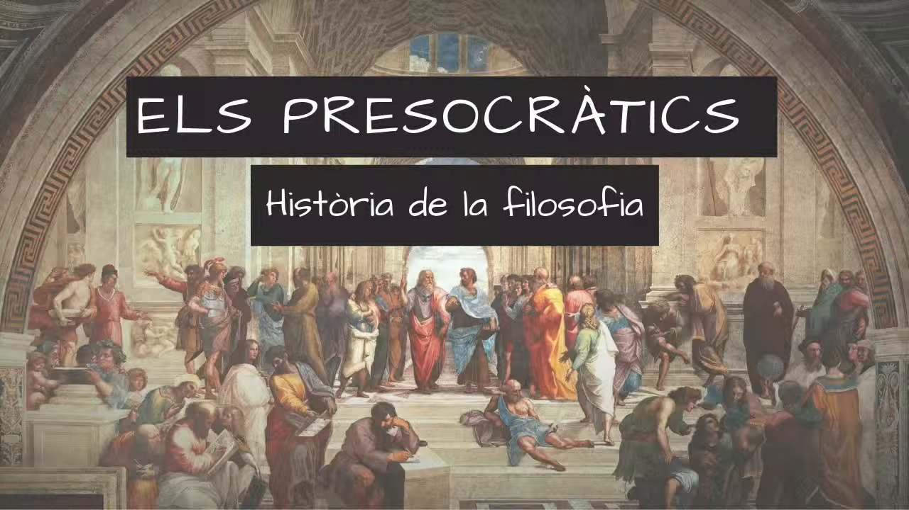

# 2. El començament de la filosofia a Grècia

## 2.1  Del mite al _lógos_

Històricament, el pensament filosòfic va aparèixer com la continuació racionalitzada del pensament mític. No hi ha un salt brusc entre mite _(mûthos)_ i filosofia, sinó que els primers filòsofs continuen barrejant motius mítics amb elements racionals. Per tant, és una característica del primer pensament grec la indiferenciació de totes dues esferes.

A la _Teogonia_ d'Hesíode, per exemple, s'explicava el naixement del món a partir del caos per obra de l'amor, que crea l'ordre com un bell cosmos. En aquest poema cosmogònic, tant l'estat de què sorgeixen les coses com la força que les crea apareixen com a categories mítiques.

La mitologia grega aportava, per tant, ja una manera d'explicació sobre com està constituïda la naturalesa _(phýsis):_ el món és un ordre sorgit del caos i es regeix per una llei la necessitat de la qual és inviolable.

Aquest ordre és mantingut per la justícia, que es manifesta en forma d'equilibri i de proporció correcta; és a dir, com l'harmonia que la llei fa sorgir de la lluita entre els contraris.

Aquests conceptes de lluita, ordre, llei, justícia són, doncs, els conceptes amb què s'elaboren les primeres explicacions de la natura i també de la vida social.

La noció d'un principi ordinador que regeix la desmesura i la multiplicitat que trobem a l'arrel de la filosofia també és l'element constitutiu essencial de l'ideal moral, estètic i humà de Grècia. A l'art i a la vida, els grecs van intentar unir elements d'una manera ordenada, unificada i harmoniosa.

El bo i el bell és l'equilibri, la combinació correcta d'elements. La poesia i el drama feien palesa l'estructura ordenada del discurs. De la mateixa manera, la música ordenava els sons segons el ritme i l'harmonia, i l'escultura o l'arquitectura combinaven ordenadament formes i línies.

 
<iframe width="100%" height="500" src="https://www.youtube.com/embed/YjllKQPOMDE" title="Els inicis de la filosofia: l&#39;ARKHÉ i la PHYSIS (Català)" frameborder="0" allow="accelerometer; autoplay; clipboard-write; encrypted-media; gyroscope; picture-in-picture; web-share" allowfullscreen></iframe>
 

## 2.2  El problema del canvi i la _phýsis_

El principal problema per als primers filòsofs va ser l'explicació del canvi a l'univers; és a dir, l'espectacle de la transició de la vida a la mort, de la generació, el creixement i la corrupció, de les coses que, sent d'una manera, deixen aviat ser-ho i, en lloc seu, n'apareixen d'altres que, alhora, canviaran de ser. Aquest procés de transformació contínua va impactar els primers filòsofs i els va empènyer a cercar una explicació de l'ordre del canvi.

<!-- [{width=50%}](1_els_presocratics_merli_tv3.mkv "Els presocràtics") -->
<!-- \begin{figure}[H] -->
<!-- \centering\href{https://www.youtube.com/watch?v=9YQsGiGbgOA}{\includegraphics[width=.6\textwidth]{img/1_els_presocratics_merli_tv3.jpg}} -->
<!-- \caption{Vídeo sobre els presocràtics, sèrie  Merlí (TV3)} -->
<!-- \end{figure} -->
<!--
<iframe id="myIframe" height="500px" src="https://www.youtube.com/embed/9YQsGiGbgOA" title="1-Els Presocràtics (Merlí - TV3)"></iframe>
frameborder="0" allow="accelerometer; autoplay; clipboard-write; encrypted-media; gyroscope; picture-in-picture; web-share" allowfullscreen></iframe>
-->

Si les coses canvien, què són de veres? Si una cosa passa de ser blanca a ser verda, aleshores és i no és blanca. Si una cosa que era deixa de ser, resulta que la mateixa cosa és i no és. La multiplicitat i la contradicció penetren en l'ésser mateix de les coses. Els pensadors grecs es pregunten aleshores què són les coses de veres, és a dir, sempre, darrere de llurs múltiples aparences.

Cerquen, per tant, en la multitud d'aspectes de les coses, llur arrel permanent i immutable, la causa o principi _(arkhé)_ de llur ésser per damunt de la variabilitat i que és capaç de donar-ne raó. Per això, allò veritablement interessant és la pregunta inicial de la filosofia: què és la naturalesa _(phýsis)_ o el principi d'on sorgeix tot?

Van pensar que, a darrer terme, totes les coses es caracteritzen per llur naturalesa (phýsis), la qual els ha estat conferida en nàixer. Un ésser humà, per exemple, és sempre un ésser humà en totes les edats de la vida perquè va rebre la naturalesa humana a l'hora de nàixer. Per això els filòsofs presocràtics centren l'interès en la naturalesa com a causa originària de les coses que persisteix a través de tots els canvis i com a principi explicatiu del canvi, de l'esdevenir.

L'aportació que fan consisteix a plantejar les eternes preguntes de la humanitat (què és l'ésser?, per què hi ha l'ésser en comptes del no-res?, què és el món i cap on va?, etc.), de manera que, des d'aquest nivell, els problemes puntuals i concrets de la política, l'economia o la ciència s'il·luminen amb significats nous. Això és, justament, allò en que els filòsofs presocràtics van ser figures exemplars, ja que, a partir d'ells, el filòsof es dedica a la meditació i a la reflexió sobre «els problemes eterns».

### Comprèn, pensa, investiga...

  1. Comparar. En què es diferencia una explicació mítica sobre l'origen del món de l'explicació filosòfica?
  2. Quin era l'ideal primordial de la cultura grega i com esdevé també el principi bàsic de la filosofia?
  3. Enumerar. Enumera els motius pels quals el primer tema de la reflexió filosòfica és el canvi a la natura.
