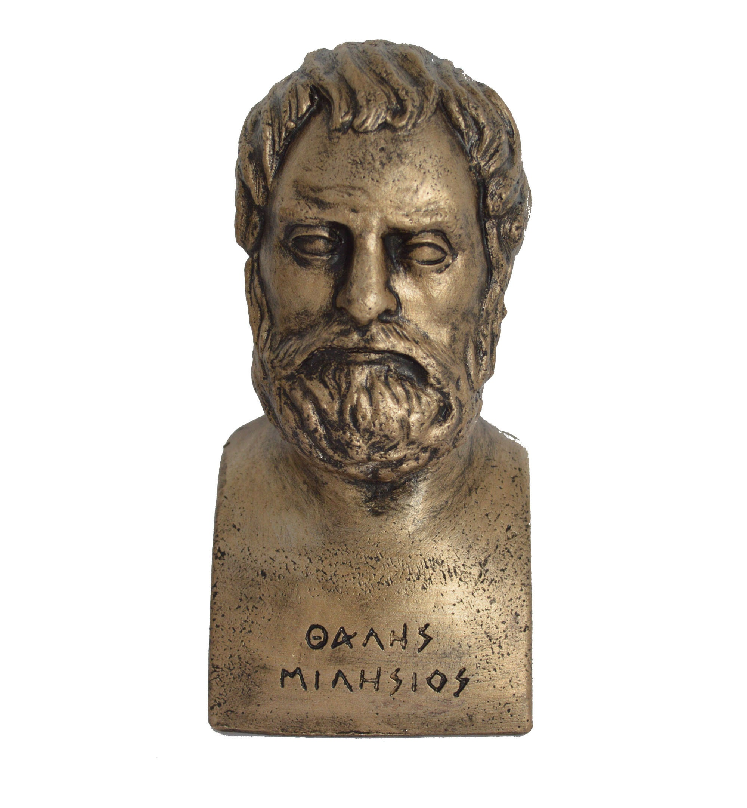
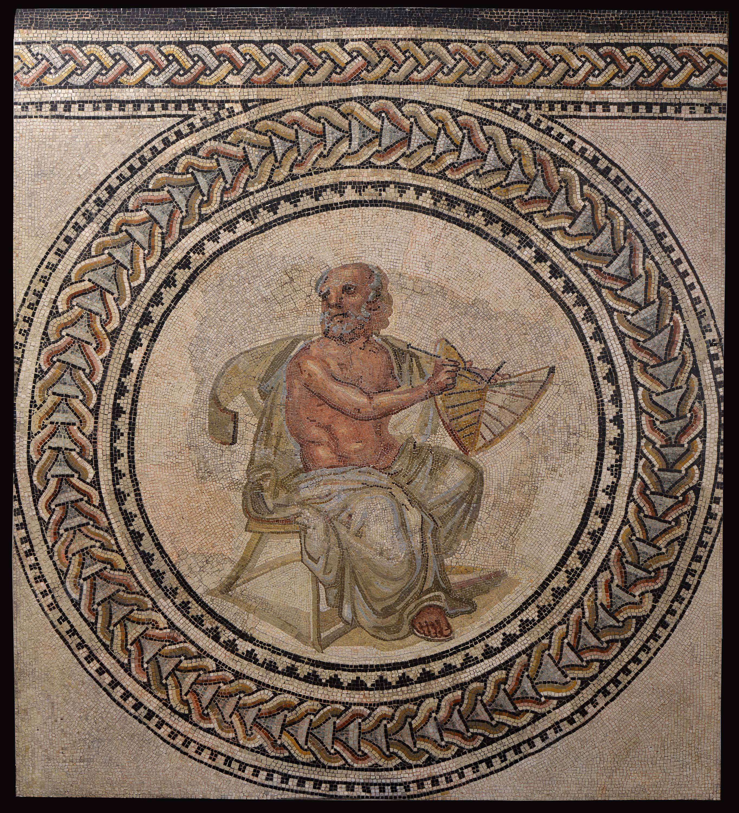
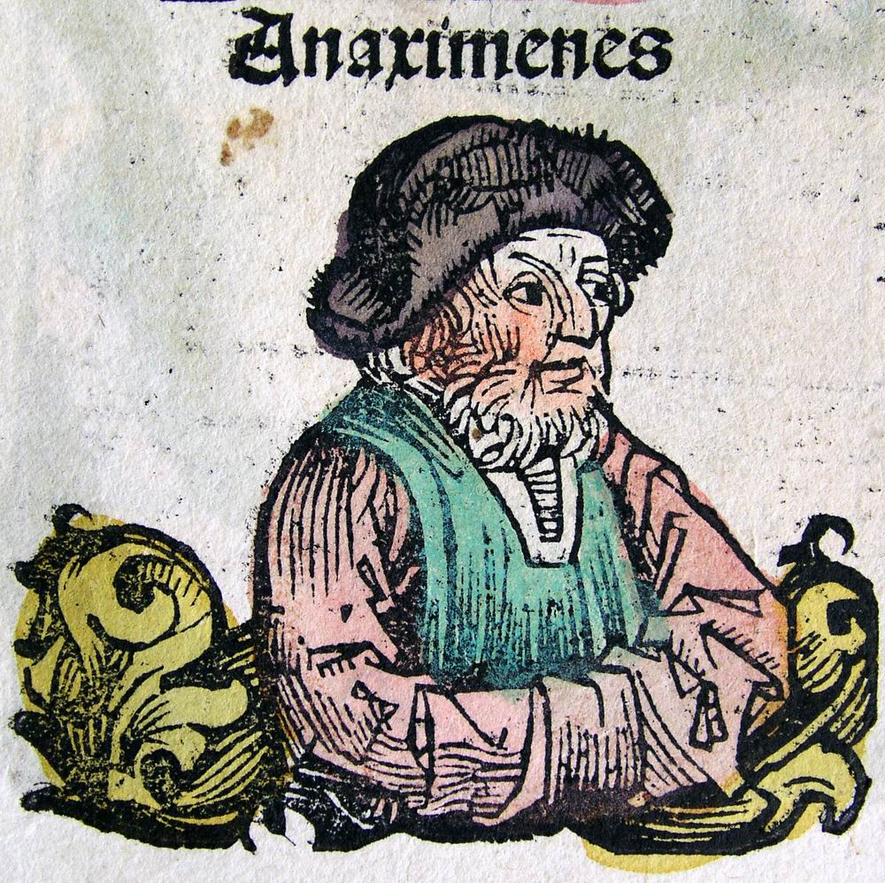
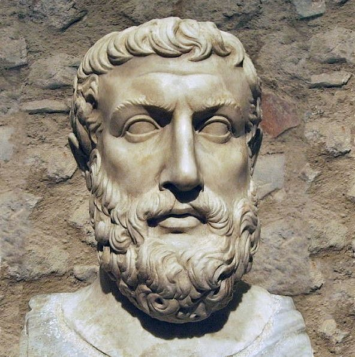
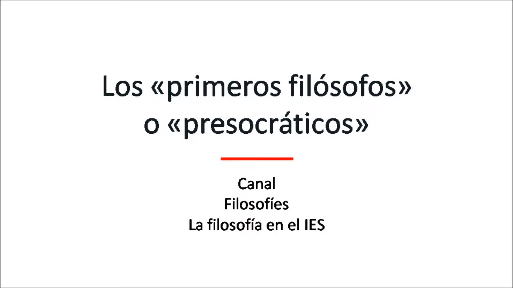

# 3. Què és la naturalesa?

 
<iframe width="100%" height="500" src="https://www.youtube.com/embed/9YQsGiGbgOA" title="1-Els Presocràtics (Merlí - TV3)"></iframe>
 

## 3.1  Les explicacions monistes

Es pot considerar, doncs, l'itinerari del pensament presocràtic com la conquesta progressiva d'una comprensió filosòfica de la naturalesa que finalment culmina en l'atomisme de **Demòcrit.** El que perseguien aquests filòsofs era un pensament lògico-racional _(lógos)_ més enllà del mite _(mûthos),_ capaç de concentrar una multiplicitat d'experiències i de percepcions, i sotmetre-les conceptualment a una unitat lògica.

El primer a aconseguir-ho va ser **Tales de Milet,** que va proposar l'explicació segons la qual tot allò que hi ha sorgeix a partir de les transformacions d'una única substància originària: l'**aigua.** Després d'ell, **Anaximandre** va pensar que calia no considerar una matèria concreta com l'aigua, sinó un *ápeiron* o substància indeterminada increada i imperible, inesgotable i indestructible.

<!--  -->
<!--  -->
<!--  -->
<!--\begin{figure}[H]
\centering
\subfloat[Tales de Milet]{\includegraphics[height=0.3\textwidth]{img/tales.jpg}}
\qquad
\subfloat[Anaximandre de Milet]{\includegraphics[height=0.3\textwidth]{img/anaximandre.jpg}}
\qquad
\subfloat[Anaxímenes de Milet]{\includegraphics[height=0.3\textwidth]{img/anaximenes.jpg}}
\end{figure}-->
<!-- \caption{El presocràtics milesis} -->
<figure align="center">
<!-- 
 -->
  
   &nbsp;
  
   &nbsp;
  
<!-- 
 -->
<figcaption align="center" style="font-style:italic;">Els presocràtics milesis: Tales, Anaximandre i Anaxímenes</figcaption>
 
</figure>

**Heraclit** i **Anaxímenes** van suposar un avanç més gran, en no acceptar, el primer, un element estable en el continu esdevenir del món natural, i en proposar, el segon, l'alternança de la condensació i la rarefacció de l'**aire** com a esquema explicatiu per comprendre canvis evolutius d'aquesta matèria primordial.

Atenció especial mereix **Parmènides,** que formula la primera teoria metafísica sobre l'ésser. Per a ell, el que hi ha és **l'ésser,** que és etern, immutable i sempre idèntic a ell mateix. El canvi de les coses que percebem és pura aparença, il·lusió dels sentits que ens oculten l'ésser que de veres constitueix les coses.

<!--  -->
<!--  -->
<!-- \Begin{table}[H] -->
<!--\begin{figure}[H]
\centering
\subfloat[Heraclit d'Efes]{\includegraphics[height=0.3\textwidth]{img/heraclit.jpg}}
\qquad
\subfloat[Parmènides d'Elea]{\includegraphics[height=0.3\textwidth]{img/parmenides.jpg}}
\end{figure}-->
<!-- \End{table} -->
<figure align="center">
<!-- 
 -->
  
   &nbsp;
  
<!-- 
 -->
<figcaption align="center" style="font-style:italic;">Heraclit d'Efes i Parmènides d'Elea</figcaption>
 
</figure>
<!--<figure align="center">

  
  <figcaption align="center" style="font-style:italic;">Heraclit d'Efes</figcaption>
   

</figure>-->

## 3.2  Els sistemes pluralistes

**Anaxàgores** representa també un altre moment de maduresa en aquest desenvolupament del pensament grec amb la hipòtesi d'un moviment circular, purament mecànic, com a causa de les transformacions de l'univers a partir d'unes partícules materials que anomena _homeomeries._ Aquest moviment estaria dirigit per un principi de naturalesa espiritual que anomena _noûs_ («intel·ligència»).

<!--  -->
<!--  -->
<!--\begin{figure}[H]
\centering
\subfloat[Anaxàgores de Clazòmenes]{\includegraphics[height=0.5\textwidth]{img/anaxagores.jpg}}
\qquad
\subfloat[Els quatre elements d'Empèdocles d'Agrigent]{\includegraphics[height=0.5\textwidth]{img/empedocles.jpg}}
\end{figure}-->
<figure align="center">
<!-- 
 -->
  
   &nbsp;
  
<!-- 
 -->
<figcaption align="center" style="font-style:italic;">Anaxàgores de Clazòmenes i Diagrama dels quatre elements d'Empèdocles d'Agrigent</figcaption>
 
</figure>

En aquesta mateixa línia, la principal aportació d'**Empèdocles** rau a atribuir al moviment de la matèria els impulsos psíquics de l'**amor** i l'**odi** com a factors motors del canvi, cosa que fa superflu el _noûs_ d'Anaxàgores. És a dir, per a Empèdocles totes les coses estan compostes pels **quatre elements:** terra, aire, aigua i foc, i l'amor crea tot allò que existeix a partir d'aquests elements, mentre que l'odi els separa.

Finalment, aquest procés intel·lectual va concloure amb el **sistema atomista** de **Leucip** i **Demòcrit**. Aquest sistema va eliminar les últimes restes mítico-antropomòrfiques encara presents a la filosofia d'Empèdocles i va substituir els principis de l'amor i l'odi com a factors del moviment per la capacitat intrínseca dels àtoms de moure's en l'espai buit; això els acosta bastant a certes hipòtesis de la física moderna.

El sistema de Demòcrit és, en suma, la culminació coherent dels diferents pensaments precedents, ja que supera de forma completa els elements mítics i ofereix la imatge de l'esdevenir de l'univers com a causa del simple moviment mecànic dels àtoms, sense haver de menester cap intervenció sobrenatural o transmundana.

<!--  -->
<!--\begin{figure}[H]
\centering
\includegraphics[width=.5\textwidth]{img/democrit.jpg}
\caption{Demòcrit d'Abdera}
\end{figure}-->
<figure align="center">
<!-- 
 -->
  
   &nbsp;
  
<!-- 
 -->
<figcaption align="center" style="font-style:italic;">Leucip i Demòcrit d'Abdera</figcaption>
 
</figure>

A partir d'aquestes consideracions sobre el pensament dels filòsofs presocràtics, tant dels monistes com dels pluralistes, cal revalorar la importància del pensament presocràtic i bandejar la imatge d'aquest primer període de la filosofia com una etapa infantil i immadura del pensament occidental.

No només s'ha de considerar la reflexió sobre les propostes d'aquests pensadors quant a la rellevància filosòfica que posseeixen, sinó també com van encarnar, per primera vegada, la figura del científic consagrat a l'exercici de pensar, fins i tot al preu de l'aïllament i del conflicte amb la societat.

<!-- [{width=60%}](los_presocraticos_-_definicion_tendencias_y_localizacion_geografica.webm "Els primers filòsofs") -->
<!--\begin{figure}[H]
\centering\href{https://www.youtube.com/watch?v=wiybVA_-yss&t=329s}{\includegraphics[width=.6\textwidth]{img/los_presocraticos_-_definicion_tendencias_y_localizacion_geografica.jpg}}
\caption{Vídeo sobre els primers filòsofs o presocràtics, Canal Filosofies (YouTube)}
\end{figure}-->
 
<iframe width="100%" height="500" src="https://www.youtube.com/embed/wiybVA_-yss" title="Los presocráticos: definición, tendencias y localización geográfica" frameborder="0" allow="accelerometer; autoplay; clipboard-write; encrypted-media; gyroscope; picture-in-picture; web-share" allowfullscreen></iframe>
 

### Comprèn, pensa, investiga

  1. Fes un esquema amb les respostes que els primers filòsofs donen a la pregunta sobre què és la naturalesa i fes un comentari de cadascuna.
  2. Comparar. En què s'oposen les filosofies d'Heraclit i de Parmènides? Raona la resposta.
  3. Interpretar. Assenyala els principals motius pels quals, al teu parer, són importants els primers filòsofs grecs.
